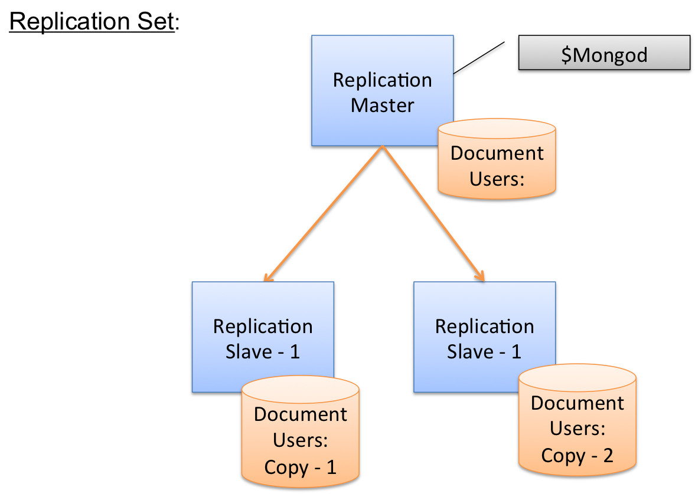

##Deploying a MongoDB cluster with Ansible

- Requires Ansible 1.2
- Expects CentOS/RHEL 7 hosts

### Data Replication

Data backup is achieved in MongoDB via _replica sets_. As the figure above shows,
a single replication set consists of a replication master (active) and several
other replications slaves (passive). All the database operations like
add/delete/update happen on the replication master and the master replicates
the data to the slave nodes. _mongod_ is the process which is responsible for all
the database activities as well as replication processes. The minimum
recommended number of slave servers are 3.

### Deploying MongoDB Ansible

#### Prerequisites

Edit the group_vars/all file to reflect the below variables.

- Use the provided Vagrant file with VirtualBox to create servers to host the
cluster and edit your hosts file to include your new servers, e.g.:
    10.0.0.101      mongo1
    10.0.0.102      mongo2
    10.0.0.103      mongo3

- If you decide to use some other virtual machines, update the name of the
ethernet adaptor (iface variable) in the /group_vars/all file and ensure that
ports 22 and 27017 are accessible.

    enp0s8     # the interface to be used for all communication.

- The default directory for storing data is /data, please change it if
required. Make sure it has sufficient space: 10G is recommended.

### Deployment Example

The inventory file looks as follows:

		#The site wide list of mongodb servers
		[mongo_servers]
		mongo1 mongod_port=27017
		mongo2 mongod_port=27017
		mongo3 mongod_port=27017

		#The list of servers where replication should happen, including the master server.
		[replication_servers]
		mongo3
		mongo1
		mongo2

Build the site with the following command:

		ansible-playbook -i hosts site.yml -u root -k

#### Verifying the Deployment

Once configuration and deployment has completed we can check replication set
availability by connecting to individual primary replication set nodes:

`mongo --host mongo1 --port 27017`

When connected, issue the following commands to query the status of the
replication set and you should get a similar output.

        use admin

        db.auth("admin", "123456")

        rs.status()
        {
        	"set" : "mongo_replication",
        	"date" : ISODate("2015-10-20T13:44:56.390Z"),
        	"myState" : 1,
        	"members" : [
        		{
        			"_id" : 0,
        			"name" : "mongo1:27017",
        			"health" : 1,
        			"state" : 1,
        			"stateStr" : "PRIMARY",
        			"uptime" : 51,
        			"optime" : Timestamp(1445267208, 2),
        			"optimeDate" : ISODate("2015-10-19T15:06:48Z"),
        			"electionTime" : Timestamp(1445348647, 1),
        			"electionDate" : ISODate("2015-10-20T13:44:07Z"),
        			"configVersion" : 1,
        			"self" : true
        		},
        		{
        			"_id" : 1,
        			"name" : "mongo2:27017",
        			"health" : 1,
        			"state" : 2,
        			"stateStr" : "SECONDARY",
        			"uptime" : 34,
        			"optime" : Timestamp(1445267208, 2),
        			"optimeDate" : ISODate("2015-10-19T15:06:48Z"),
        			"lastHeartbeat" : ISODate("2015-10-20T13:44:55.949Z"),
        			"lastHeartbeatRecv" : ISODate("2015-10-20T13:44:54.658Z"),
        			"pingMs" : 1,
        			"configVersion" : 1
        		},
        		{
        			"_id" : 2,
        			"name" : "mongo3:27017",
        			"health" : 1,
        			"state" : 2,
        			"stateStr" : "SECONDARY",
        			"uptime" : 50,
        			"optime" : Timestamp(1445267208, 2),
        			"optimeDate" : ISODate("2015-10-19T15:06:48Z"),
        			"lastHeartbeat" : ISODate("2015-10-20T13:44:55.933Z"),
        			"lastHeartbeatRecv" : ISODate("2015-10-20T13:44:55.129Z"),
        			"pingMs" : 0,
        			"configVersion" : 1
        		}
        	],
        	"ok" : 1
        }

### Scaling the Cluster
---------------------------------------

To add a new node to the existing MongoDB Cluster, modify the inventory file as follows:

		#The site wide list of mongodb servers
		[mongoservers]
		mongo1 mongod_port=27017
		mongo2 mongod_port=27017
		mongo3 mongod_port=27017
		mongo4 mongod_port=27017

		#The list of servers where replication should happen, make sure the new node is listed here.
		[replicationservers]
		mongo4
		mongo3
		mongo1
		mongo2

Make sure you have the new node added in the _replicationservers_ section and
execute the following command:

		ansible-playbook -i hosts site.yml

###Verification

The newly added node can be easily verified by checking the replication status
and seeing the data being copied to the newly added node.

###Serverspec

Verify the servers using serverspec with ansible_spec

    $gem install ansible_spec
    $rake T
    rake serverspec:common
    rake serverspec:mongod
    rake serverspec:mongos
    rake serverspec:shards
    $rake serverspec:mongod
